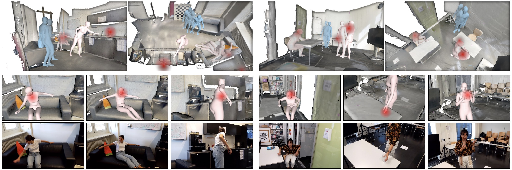

# EgoBody: Human Body Shape and Motion of Interacting People from Head-Mounted Devices
EgoBody dataset is a novel large-scale dataset for egocentric 3D human pose, shape and motions under interactions in complex 3D scenes.

[[Project page]](https://sanweiliti.github.io/egobody/egobody.html) 
[[Paper]](https://arxiv.org/pdf/2112.07642.pdf)
[[Dataset]](https://egobody.inf.ethz.ch)
[[EgoBody challenge]](https://codalab.lisn.upsaclay.fr/competitions/6351)





### News
**[December 04, 2023]** Text descriptions for motions are provided by [Motion-X Dataset](https://github.com/IDEA-Research/Motion-X).

**[October 20, 2022]** All modalities of EgoBody are released (including third-person view RGBD, 3D scene, eye gaze/hand/head tracking, 3D human shape and motion annotations for the camera wearer, etc.)! 

**[July 17, 2022]** The [EgoBody challenge](https://codalab.lisn.upsaclay.fr/competitions/6351) is released! The first phase of the challenge will end at October 1st. The participants are welcome to submit a 2-4 page abstract to our ECCV workshop.

**[July 08, 2022]** The EgoSet (egocentric RGB subset of EgoBody) is released! Other modalities (third-person view RGBD, 3D scene, eye gaze, etc.) will come soon.

**[June 01, 2022]** The EgoBody dataset will be part of the ECCV2022 workshop: Human Body, Hands, and Activities from Egocentric and Multi-view Cameras. 
Please check out our [workshop website](https://sites.google.com/view/egocentric-hand-body-activity) for more information.

## Dataset License/Download
Please register, sign the dataset license and download the dataset at [https://egobody.inf.ethz.ch](https://egobody.inf.ethz.ch). 

## Dataset Information
EgoBody dataset contains 125 sequences, 36 subjects and 15 indoor scenes. Please find more detailed statistics in our paper.

|frames              |     train    |     val    |    test   |    total   |   
|--------------------|:------------:|:----------:|:---------:|:----------:|
| MVSet              |   116630     |   29140    |   73961   |   219731   |
| EgoSet             |   105388     |   25416    |   68307   |   199111   |
| EgoSet_interactee  |    90124     |   23332    |   62155   |   175611   |
* `MVSet`:  synchronized frames captured from the Azure Kinects, from multiple third-person views
* `EgoSet`: egocentric RGB frames captured from the HoloLens, calibrated and synchronized with the Kinect frames
* `EgoSet_interactee`: frames where the interactee is visible in the egocentric view

## Dataset Documentation
### Info/calibration files:
```
EgoBody
├── data_info_release.csv
├── data_splits.csv
├── kinect_cam_params
│   ├── kinect_master/kinect_sub_1/kinect_sub_2/kinect_sub_3/kinect_sub_4
│   │   ├── Color.json
│   │   ├── IR.json
├── calibrations
│   ├── RECORDING_NAME
│   │   ├── kinect12_to_world/$scene_name$.json
│   │   ├── holo_to_kinect12.json
│   │   ├── kinect_11to12_color.json
│   │   ├── kinect_13to12_color.json
│   │   ├── (kinect_14to12_color.json)
│   │   ├── (kinect_15to12_color.json)
```
* `data_info_release.csv`: basic information for all sequences
    * `recording_name`: name for each sequence, named as `recording_202xxxxx_Sxx_Sxx_xx`. `202xxxxx` is the capture date, and `Sxx_Sxx` refers to `subjectID(cemera_wearer)_subjectID(interactee)`
    * `body_idx_0`: gender of the body with index 0 in each sequence
    * `body_idx_1`: gender of the body with index 1 in each sequence
    * `body_idx_fpv`: body index and gender of the interactee in each sequence
    * `start_frame`/`end_frame`: the frame ID of starting/ending frame for each sequence
    * `scene_name`: name of the 3D scene for each sequence
* `data_splits.csv`: train/validation/test sequence splits
* `calibrations`: extrinsics between kinects/hololens/3D scene for each sequence
    * Note that the kinects are labelled as: 12 (`master`), 11 (`sub_1`), 13 (`sub_2`), 14 (`sub_3`), 15 (`sub_4`)
    * `kinect12_to_world/$scene_name$.json`: extrinsics between `master` kinect RGB camera and the 3D scene mesh
    * `holo_to_kinect12.json`: extrinsics between `master` kinect RGB camera and the hololens world coordinate system
    * `kinect_11to12_color.json`: extrinsics between RGB camera of the `master` kinect and `sub_1` kinect
    * `kinect_13to12_color.json`: extrinsics between RGB camera of the `master` kinect and `sub_2` kinect
    * `kinect_14to12_color.json`: extrinsics between RGB camera of the `master` kinect and `sub_3` kinect, only exists for data captured in 2022
    * `kinect_15to12_color.json`: extrinsics between RGB camera of the `master` kinect and `sub_4` kinect, only exists for data captured in 2022
* `kinect_cam_params`:
    * `kinect_master/kinect_sub_1/kinect_sub_2/kinect_sub_3/kinect_sub_4`: intrinsics and extrinsics of the color/depth camera for each kinect

### Egocentric data streams

```
EgoBody
├── egocentric_color
│   ├── RECORDING_NAME
│   │   ├── 202x-xx-xx-xxxxxx
│   │   │   ├── PV
│   │   │   ├── 202x-xx-xx-xxxxxx_pv.txt
│   │   │   ├── keypoints.npz
│   │   │   ├── valid_frame.npz
├── egocentric_depth
│   ├── RECORDING_NAME
│   │   ├── 202x-xx-xx-xxxxxx
│   │   │   ├── ...
├── egocentric_gaze
│   ├── RECORDING_NAME
│   │   ├── 202x-xx-xx-xxxxxx
│   │   │   ├── 202x-xx-xx-xxxxxx_head_hand_eye.csv
```
* `egocentric_color`: egocentric RGB images and hololens camera information
    * `RECORDING_NAME`: recording_name
    * `PV`: egocentric RGB frames of the current sequence, named as `timestamp_frame_xxxxx.jpg`, where `frame_xxxxx` is the ID for each frame
    * `202x-xx-xx-xxxxxx_pv.txt`: 
        * row 1: RGB(PV) camera `cx`, `cy`, `w`, `h` of the current sequence
        * row >=2: `timestamp`, `fx`, `fy`, `pv2world_transform` of each each RGB(pv) frame. 
        `pv2world_transform` is the extrinsics between the RGB(PV) camera of each frame and the hololens world coordinate of the current sequece (each hololens sequence has a consitent world coordinate system for the whle sequence).
    * `keypoints.npz`: 
        * `imgname`: egocentric PV image paths (e.x., `egocentric_color/RECORDING_NAME/202x-xx-xx-xxxxxx/PV/timestamp_frame_xxxxx.jpg`)
        * `center`: center of the bounding box (to crop the person out) for each PV frame
        * `scale`: scale of the bounding box for each PV frame
        * `keypoints`: openpose body joints (BODY_25 format) of the person (interactee) for each PV frame
        * `gender`: gender of the interactee for each PV frame
    * `valid_frame.npz`: 
        * `imgname`: egocentric PV image paths (e.x., `egocentric_color/RECORDING_NAME/202x-xx-xx-xxxxxx/PV/timestamp_frame_xxxxx.jpg`)
        * `valid`: `True/False`, `True` indicates that the detected openpose body joints >= 6 for the interactee in each PV frame
    * Note: `keypoints.npz`, `valid_frame.npz` and `202x-xx-xx-xxxxxx_pv.txt` can contain frame IDs outside of the range of `[start_frame, end_frame]`, please ignore those frames.
* `egocentric_depth`: egocentric depth recordings
    * `RECORDING_NAME`: recording_name
    * each sequence contains recorded depth, lookup table, and depth camera extrinsics (please refer [here](https://github.com/microsoft/HoloLens2ForCV/blob/main/Samples/StreamRecorder/StreamRecorderConverter/save_pclouds.py) for more information)
* `egocentric_gaze`: egocentric eye gaze recordings
    * `RECORDING_NAME`: recording_name
    * `202x-xx-xx-xxxxxx_head_hand_eye.csv`: each row includes `timestamp` and `head/hand/eye gaze tracking` for the current timestamp, please refer `load_head_hand_eye_data()` in `utils.py` for details.

### Third-person view data streams
```
EgoBody
├── kinect_color
│   ├── RECORDING_NAME
│   │   ├── master/sub_1/sub_2(/sub_3/sub_4)
│   │   │   ├── frame_xxxxx.jpg
├── kinect_depth
│   ├── RECORDING_NAME
│   │   ├── master/sub_1/sub_2(/sub_3/sub_4)
│   │   │   ├── frame_xxxxx.png
```
* `kinect_color`: multi-view third-person view RGB images captured by Kinect cameras
    * `RECORDING_NAME`: recording_name
    * `master/frame_xxxxx.jpg`: RGB frame for `master` kinect
    * `sub_1/frame_xxxxx.jpg`: RGB frame for `sub_1` kinect ...
    * Note that here frame ID `frame_xxxxx` is synchronized with the corresponding egocentric RGB frame `timestamp_frame_xxxxx.jpg` of the same sequence.
* `kinect_depth`: multi-view third-person view depth images captured by Kinect cameras
    * `RECORDING_NAME`: recording_name
    * `master/frame_xxxxx.png`: depth frame for `master` kinect
    * `sub_1/frame_xxxxx.png`: depth frame for `sub_1` kinect ...
    * Note that here frame ID `frame_xxxxx` is synchronized with the kinect RGB frame with frame ID `frame_xxxxx`

### 3D scene meshes
```
EgoBody
├── scene_mesh
│   ├── $scene_name$
│   │   ├── $scene_name$.obj
```
* `$scene_name.obj$`: 3D scene mesh for scene `$scene_name$`

### 3D human pose, shape and motion annotations
```
EgoBody
├── smplx_interactee_train
│   ├── RECORDING_NAME/body_idx_x/results/frame_xxxxx/000.pkl
├── smplx_interactee_val
├── smplx_camera_wearer_train
│   ├── RECORDING_NAME/body_idx_x/results/frame_xxxxx/000.pkl
├── smplx_camera_wearer_val
├── smpl_interactee_train
│   ├── RECORDING_NAME/body_idx_x/results/frame_xxxxx/000.pkl
├── smpl_interactee_val
├── smpl_camera_wearer_train
│   ├── RECORDING_NAME/body_idx_x/results/frame_xxxxx/000.pkl
├── smpl_camera_wearer_val
```
* `smplx_interactee_train/val` and `smplx_camera_wearer_train/val`: SMPL-X body parameters for each frame of the interactee/camera wearer in training/val set
    * always in the coordinate system of the `master` kinect RGB camera
    * `body_idx_x` is the body index of the interactee/camera wearer in the current sequence, and `frame_xxxxx` is the ID for each frame.
* `smpl_interactee_train/val` and `smpl_camera_wearer_train/val`: SMPL body parameters for each frame of the interactee/camera wearer

### Motion text descriptions
Text descriptions for motions are provided by [Motion-X Dataset](https://github.com/IDEA-Research/Motion-X).


## Visualization Code
**Render SMPL-X/SMPL bodies from the egocentric (hololens) view**:
```
python release_renderer_fpv_gaze.py --release_data_root=PATH/TO/DATASET  --save_root=PATH/TO/SAVE/RESULTS --recording_name RECORDING_NAME --scene_name SCENE_NAME
```
Available options:
* `model_type`: `smpl/smplx`, render SMPL-X or SMPL bodies
* `plot_2d_joints`: if set to `True`, plot 2D joints of openpose detections and the projected 2D joints of ground truth SMPL-X/SMPL bodies
* `plot_gaze`: if set to `True`, plot 2D projection of the camera wearer's gaze point on egocentric view images
* `rendring_mode`: `body` renders 3D body mesh projected on the RGB images, `3d` renders 3D body mesh in 3D scenes, `both` renders both options 
* `model_folder`: the path to SMPL-X/SMPL models


**Render SMPL-X/SMPL bodies from the third-person (kinect) view**: 
```
python release_renderer_kinect.py --release_data_root=PATH/TO/DATASET  --save_root=PATH/TO/SAVE/RESULTS --recording_name RECORDING_NAME --scene_name SCENE_NAME
```
Available options:
* `model_type`: `smpl/smplx`, render SMPL-X or SMPL bodies
* `view`: from which view of kinect to render the body (options: `master/sub_1/sub_2/sub_3/sub_4`)
* `rendring_mode`: `body` renders 3D body mesh projected on the RGB images, `3d` renders 3D body mesh in 3D scenes, `both` renders both options 
* `model_folder`: the path to SMPL-X/SMPL models

**Visualize point clouds from kinect RGB/depth and the 3d scene mesh together**:
```
python release_vis_kinect_scene.py --release_data_root=PATH/TO/DATASET  --recording_name RECORDING_NAME --scene_name SCENE_NAME
```
Available options:
* `vis_frame_id`: which frame to visualize, in the format of `xxxxx`, for example, `03000'

**Visualize point clouds from kinect RGB/depth of all kinect views together**:
```
python release_vis_kinect_pcd.py --release_data_root=PATH/TO/DATASET  --recording_name RECORDING_NAME
```
Available options:
* `vis_frame_id`: which frame to visualize, in the format of `xxxxx`, for example, `03000'

**To read the depth, head/hand tracking data:**

Please refer to [HoloLens2ForCV](https://github.com/microsoft/HoloLens2ForCV/tree/main) for details. 

* To read hololens depth and convert to point clouds, use: `HoloLens2ForCV/Samples/StreamRecorder/StreamRecorderConverter/save_pclouds.py`
* To read head/hand tracking data and project onto the egocentric image, use: `HoloLens2ForCV/Samples/StreamRecorder/StreamRecorderConverter/project_hand_eye_to_pv.py`

## Baseline Results
|Method                                                            |     MPJPE    |     PA-MPJPE    |      V2V       |     PA-V2V    |   
|------------------------------------------------------------------|:------------:|:---------------:|:--------------:|:-------------:|
| [CMR](https://github.com/nkolot/GraphCMR/)                       |    200.7     |      109.6      |      218.7     |     136.8     |
| [SPIN](https://github.com/nkolot/SPIN)                           |    182.8     |      116.6      |      187.3     |     123.8     |
| [LGD](https://github.com/InpatientJam/Learned-Gradient-Descent)  |    158.0     |      99.9       |      168.3     |     106.0     |
| [METRO](https://github.com/microsoft/MeshTransformer)            |    153.1     |      98.4       |      164.6     |     106.5     |
| [PARE](https://github.com/mkocabas/PARE)                         |    123.0     |      83.8       |      131.4     |     89.7      |
| [EFT](https://github.com/facebookresearch/eft)                   |    123.9     |      78.4       |      135.0     |     86.0      |
| **SPIN-ft**                                                      |    106.5     |      67.1       |      120.9     |     78.3      |
| **METRO-ft**                                                     |    **98.5**  |      66.9       |      **110.5** |     76.8      |
| **EFT-ft**                                                       |    102.1     |      **64.8**   |      116.1     |     **74.8**  |
* Here '-ft' denotes results of fine-tuning SPIN, METRO and EFT on our training set. 

## Citation
```
@inproceedings{Zhang:ECCV:2022,
   title = {EgoBody: Human Body Shape and Motion of Interacting People from Head-Mounted Devices},
   author = {Zhang, Siwei and Ma, Qianli and Zhang, Yan and Qian, Zhiyin and Kwon, Taein and Pollefeys, Marc and Bogo, Federica and Tang, Siyu},
   booktitle = {European conference on computer vision (ECCV)},
   month = oct,
   year = {2022}
}
```

## Acknowledgments
This work was supported by the Microsoft Mixed Reality & AI Zurich Lab PhD scholarship. 
Qianli Ma is partially funded by the Max Planck ETH Center for Learning Systems. We sincerely thank Francis Engelmann, Korrawe Karunratanakul, Theodora Kontogianni, Qi Ma, Marko Mihajlovic, Sergey Prokudin, Matias Turkulainen, Rui Wang , Shaofei Wang and Samokhvalov Vyacheslav for helping with the data capture and processing, Xucong Zhang for the discussion of data collection and Jonas Hein for the discussion of the hardware setup.
Siyu Tang acknowledges the SNF grant 200021 204840.

## Relevant projects
The motion reconstruction pipeline benefits from:

[Learning Motion Priors for 4D Human Body Capture in 3D Scenes](https://github.com/sanweiliti/LEMO) (ICCV 2021 (Oral)) <br>
Siwei Zhang, Yan Zhang, Federica Bogo, Marc Pollefeys and Siyu Tang <br>


[Resolving 3D Human Pose Ambiguities with 3D Scene Constraints](https://github.com/mohamedhassanmus/prox) (ICCV 2019) <br>
Mohamed Hassan, Vassilis Choutas, Dimitrios Tzionas and Michael J. Black <br>


