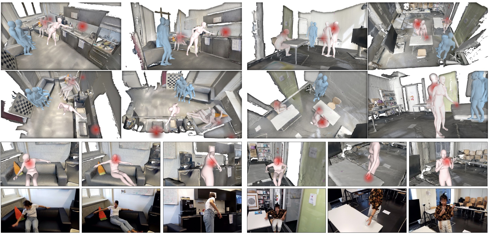

# EgoBody: Human Body Shape, Motion and Social Interactions from Head-Mounted Devices
EgoBody dataset is a novel large-scale dataset for social interactions in complex 3D scenes.

[[Project page]](https://sanweiliti.github.io/egobody/egobody.html) 
[[Video]](https://youtu.be/nHxEZLOjzHo) 
[[Paper]](https://arxiv.org/pdf/xxxx.pdf)

## EgoBody Datast
coming soon

## Code
coming soon